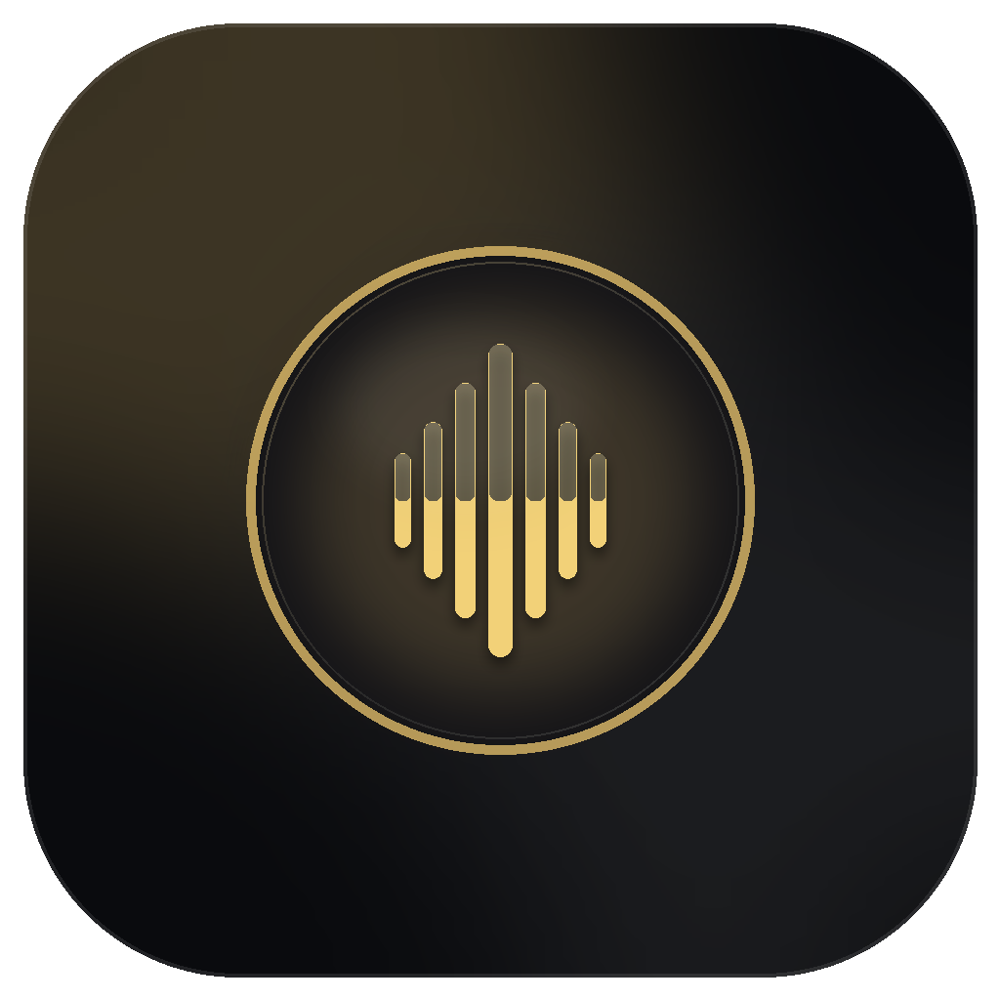

<p align="center">
  
</p>

<h1 align="center">AIVPlayer</h1>

<p align="center">
  <strong>本地 AI 字幕生成的跨平台桌面视频播放器</strong>
</p>

<p align="center">
  <a href="https://github.com/ponponon/aivplayer/releases">
    
  </a>
  <a href="https://github.com/ponponon/aivplayer/blob/main/LICENSE">
    
  </a>
  
</p>

<p align="center">
  <a href="#features">功能特性</a> ·
  <a href="#installation">安装指南</a> ·
  <a href="#development">开发指南</a> ·
  <a href="#contributing">参与贡献</a> ·
  <a href="#license">开源协议</a>
</p>

---

## 关于

AIVPlayer 是一款基于 Electron 的现代化桌面视频播放器，核心亮点是集成了 [whisper.cpp](https://github.com/ggerganov/whisper.cpp) 本地 ASR 引擎，可以在不联网的情况下为视频自动生成高质量字幕。

### 为什么做这个？

现有播放器大多依赖在线字幕服务，存在隐私泄露、需要付费、网络依赖等问题。AIVPlayer 选择将 AI 能力完全本地化，让你的视频和字幕数据始终留在自己手里。

---

## 功能特性

### 视频播放

- 支持 MP4、WebM、MOV、MKV、AVI 等主流视频格式
- 拖拽导入或文件选择器打开视频
- 播放列表支持，快捷键切换上一条/下一条
- 音量、倍速、进度控制
- 单击画面暂停/恢复
- 全屏播放

### AI 字幕生成

- 基于 whisper.cpp 的离线语音识别，无需联网
- 支持多语言语音识别（中文、英文、日语、韩语等）
- 同时生成 VTT 和 SRT 两种字幕格式
- 自动缓存字幕，重复打开同一视频直接加载
- 支持从 ModelScope（国内源）和 Hugging Face 下载模型

### 命令行工具

安装 AIVPlayer 后会同时提供 `aivcli` 命令；CLI 与桌面端共用本地 ASR 模型、字幕缓存和视觉影视库。

```bash
aivcli doctor
aivcli media info ./movie.mp4
aivcli asr ./movie.mp4 --format both --output-dir ./subtitles
aivcli subtitle convert ./movie.vtt
aivcli subtitle translate ./movie.vtt --to zh --output-dir ./subtitles
aivcli library index ./Videos --recursive
aivcli library search "海边场景"
aivcli batch ./Videos --recursive --asr --translate zh --index --output-dir ./subtitles
aivcli batch ./Videos --recursive --asr --translate zh --index --resume
```

`batch` 会按视频顺序执行 ASR、字幕翻译和影视库索引；默认单个视频失败后继续处理，其余任务仍会完成。任务状态默认保存到 AIVPlayer 用户数据目录，也可以通过 `--state-file ./batch-state.json` 指定位置。任务中断后使用相同参数加 `--resume`，已完成且产物仍存在的阶段会跳过；视频文件大小或修改时间变化后，该视频的阶段会自动失效并重跑。需要遇到错误立即停止时使用 `--fail-fast`，需要放弃旧状态重新开始时使用 `--reset-state`。

如果只指定 `--translate` 而不指定 `--asr`，会读取视频旁边同名的 `.vtt` 文件；指定 `--output-dir` 且同时翻译时，译文会追加目标语言后缀（例如 `movie.zh.vtt`），避免覆盖原文字幕。

所有主要命令支持 `--json`，方便批处理脚本消费结构化结果。

### 片段导出

- 基于当前播放位置快速导出短片段
- 支持 15 秒、30 秒、60 秒三档长度
- 导出模式：纯视频 / 外挂字幕 / 字幕烧录

### 截图与录屏

- 截取当前画面为图片
- 录制指定时长的视频片段
- 支持 GIF 导出

### 多语言界面

- 简体中文、English、日本語、한국어
- 系统语言自动匹配，也可手动切换

### 现代化 UI

- 深色影院风格，视频优先
- 控制栏自动隐藏，沉浸式体验
- 响应式布局，适配不同窗口尺寸

---

## 安装

### 系统要求

- **macOS**: 10.15+
- **Windows**: 10+
- **Linux**: Ubuntu 18.04+ / 同等发行版

### 下载安装包

从 [Releases](https://github.com/ponponon/aivplayer/releases) 页面下载对应平台的安装包：

| 平台 | 格式 |
|------|------|
| macOS | `.dmg` / `.zip` |
| Windows | `.exe` (NSIS 安装器) |
| Linux | `.AppImage` / `.deb` |

Windows NSIS、macOS `.pkg` 和 Linux `.deb` 会同时安装 `aivcli` 命令。macOS `.dmg` / `.zip` 与 Linux `.AppImage` 是便携式分发格式，不会自动修改系统 PATH；这两种格式可以直接使用应用可执行文件的 `--cli` 模式，或自行建立启动器。

### 从源码构建

```bash
# 克隆仓库
git clone https://github.com/ponponon/aivplayer.git
cd aivplayer

# 安装依赖（需要 Node.js 22.12.0+）
npm install

# 启动开发模式
npm run dev
```

> **注意**：部分网络环境访问 npm 可能需要配置代理。

---

## 开发指南

### 环境准备

- Node.js 22.12.0+
- npm 或 pnpm
- macOS 需要 Xcode Command Line Tools
- Windows 需要 Visual Studio Build Tools

### 可用命令

```bash
# 开发
npm run dev              # 启动开发服务器

# 构建
npm run build            # 构建生产版本
npm run preview          # 预览构建结果
npm run pack             # 打包（不生成安装程序）
npm run dist             # 完整打包（生成安装程序）

# 检查
npm run typecheck        # TypeScript 类型检查
npm run test             # 运行单元测试
npm run doctor:backend   # 检查后端依赖
npm run doctor:asr       # 检查 ASR 运行时

# ASR 相关
npm run release:prepare-runtime -- \
  --whisper-dir /path/to/whisper.cpp/build/bin \
  --ffmpeg-bin /path/to/ffmpeg
```

### 项目结构

```
aivplayer/
├── src/
│   ├── desktop/         # Electron 主进程与桌面适配
│   │   ├── index.ts     # 应用入口
│   │   ├── ipc-*.ts     # IPC 注册
│   │   └── media/       # Electron 媒体协议
│   ├── core/            # 桌面端与 CLI 共用的无 Electron 业务能力
│   │   ├── ai/          # ASR、翻译和视觉影视库
│   │   ├── drama/       # 短剧工作流
│   │   └── media/       # 媒体解析与导出
│   ├── preload/         # 预加载脚本（IPC 桥接）
│   ├── renderer/        # React 渲染进程
│   │   └── src/
│   │       ├── app/     # UI 组件
│   │       ├── lib/     # 工具函数
│   │       └── styles/  # 样式
│   └── shared/          # 桌面端与渲染进程共享类型
├── resources/           # 运行时资源（whisper.cpp、ffmpeg）
├── scripts/             # 构建与工具脚本
├── tests/               # 测试文件
└── docs/                # 文档
```

### 技术栈

| 类别 | 技术 |
|------|------|
| 桌面框架 | Electron |
| 前端框架 | React 19 |
| 构建工具 | Vite + electron-vite |
| 类型系统 | TypeScript |
| 图标库 | lucide-react |
| ASR 引擎 | whisper.cpp |
| 测试框架 | Vitest + Playwright |
| 打包工具 | electron-builder |

---

## 参与贡献

欢迎提交 Issue 和 Pull Request！

1. Fork 本仓库
2. 创建特性分支 (`git checkout -b feature/amazing-feature`)
3. 提交更改 (`git commit -m 'feat: add amazing feature'`)
4. 推送到分支 (`git push origin feature/amazing-feature`)
5. 创建 Pull Request

### 提交规范

请遵循 [Conventional Commits](https://www.conventionalcommits.org/) 规范：

- `feat:` 新功能
- `fix:` 修复 Bug
- `docs:` 文档更新
- `style:` 代码格式（不影响功能）
- `refactor:` 重构
- `test:` 测试相关
- `chore:` 构建/工具相关

---

## 开源协议

本项目基于 [MIT License](LICENSE) 开源。

---

## 致谢

- [whisper.cpp](https://github.com/ggerganov/whisper.cpp) - 本地语音识别引擎
- [Electron](https://electronjs.org/) - 跨平台桌面应用框架
- [React](https://react.dev/) - UI 框架
- [lucide-react](https://lucide.dev/) - 图标库

---

<p align="center">
  如果觉得有用，请给个 ⭐ Star 支持一下！
</p>
